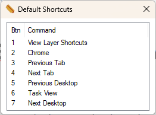

# AutoHotKey Layered Macro Builder

---
*The starting point to build your perfect macro keyboard.*

Define macro layers in code which are automatically bound to your macro pad buttons. A User Interface is generated from the configured macros to easily manage the state of the program.

## Getting started

* Install AutoHotkey v2
* Edit Main.ahk, this is where the Keybindings for your macro pad buttons are.
*Example:*
```
    ; +----------+----------+
    ; | F17 = 1  | F18 = Fn |
    ; +----------+----------+
    ...
    *F18:: ; Fn
    {   
       key := 'F18'
       ; variables
       global selectionGui
       global config
       global mode
       if KeyWait(key, 'T0.1') {
          if KeyWait(key, 'D T0.1') {
             ; show the shortcuts for the selected layer
             preview := ViewShortcutsGui(config.layers[selectionGui.GetSelectedLayer()])
             preview.Show()                             
             return
          }
       } else {
          ToggleLayerSelection(key)
       }

    }

    F17:: ; 1
    {
       button := 1
       ActivateOrSelectMacro(button)
    }
    ...
```
* Edit Macros.ahk.
*Example:*
```
    ; Create a new MacroLayer object with the argument, buttons:int - the amount of non-function buttons available.
    ; Call the AddNewLayer function on the MacroLayers object with the arguments, 
    ;   title:string - the name of the layer
    ;   icon:filepath - the path to the regular icon image
    ;   selected:filepath - the path to the selected icon image
    ;   newMacros: array of Macro objects with the argument for each being,
    ;           hotkey:string - the name for the Macro
    ;           action:function - the function to be called
    ;
    ; IMPORTANT: Only add the function name to the Macro object, not the function call.
    ; Example: 
    
    ...
    Macro("Toggle Breakpoint", ToggleBreakpoint)
    ...
    ToggleBreakPoint(args) {
       Send("{F9}")
    }
    ...
```
## Showcase

### Macro Layers UI

### Shortcut View UI

